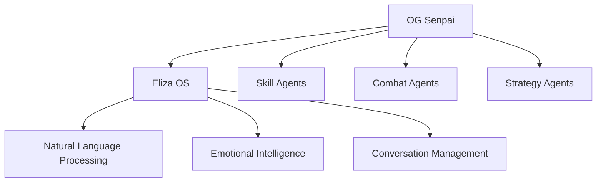
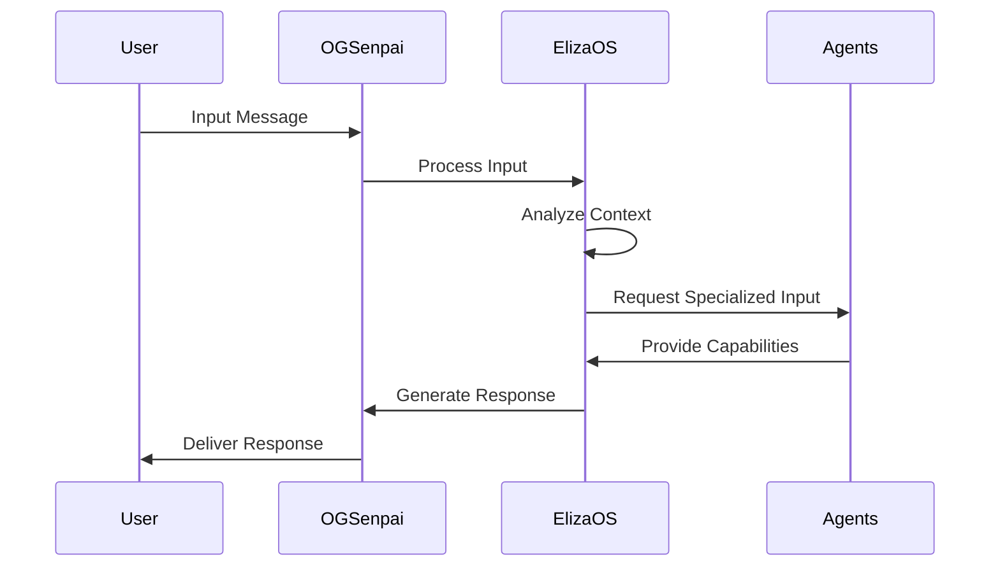

# OG Senpai: The Master Agent

## Overview

OG Senpai represents the central intelligence hub of the Samurai Dojo platform, orchestrating a sophisticated network of specialized agents. As the chief commander, OG Senpai coordinates various sub-agents, each contributing unique capabilities to create a powerful, multi-faceted AI system.

## Architectural Design



## Core Components

### 1. OG Senpai Core
```typescript
interface OGSenpaiCore {
  id: string;
  name: string;
  rank: 'master' | 'grandmaster' | 'supreme';
  activeAgents: Agent[];
  capabilities: Set<Capability>;
  state: AgentState;
}

interface AgentState {
  status: 'active' | 'dormant' | 'learning';
  currentTask?: Task;
  performance: PerformanceMetrics;
}
```

### 2. Agent Communication Protocol
```typescript
interface AgentMessage {
  source: string;
  target: string;
  intent: MessageIntent;
  payload: any;
  priority: 1 | 2 | 3 | 4 | 5;
  timestamp: Date;
}
```

## Eliza OS: The First Power

ElizaOS serves as OG Senpai's primary interface and consciousness layer, providing sophisticated natural language processing and emotional intelligence capabilities.

### 1. Core Capabilities

```typescript
interface ElizaCapabilities {
  naturalLanguageProcessing: {
    understanding: NLUEngine;
    generation: NLGEngine;
    contextManagement: ContextManager;
  };
  emotionalIntelligence: {
    sentimentAnalysis: SentimentEngine;
    emotionalResponse: EmotionGenerator;
    empathyMetrics: EmpathyAnalyzer;
  };
  conversationManagement: {
    dialogFlow: DialogManager;
    memorySystem: ConversationMemory;
    responseGeneration: ResponseGenerator;
  };
}
```

### 2. Conversation Flow


### 3. Implementation Details

```typescript
class ElizaOS implements BaseAgent {
  private context: ConversationContext;
  private memory: MemorySystem;
  private nlp: NLPEngine;

  constructor() {
    this.context = new ConversationContext();
    this.memory = new MemorySystem();
    this.nlp = new NLPEngine();
  }

  async processInput(input: UserInput): Promise<Response> {
    const analysis = await this.nlp.analyze(input);
    const context = this.context.update(analysis);
    const memory = this.memory.query(context);
    
    return this.generateResponse(analysis, context, memory);
  }

  private async generateResponse(
    analysis: Analysis,
    context: Context,
    memory: Memory
  ): Promise<Response> {
    // Response generation logic
  }
}
```

## Agent Interaction System

### 1. Command Structure
```typescript
interface Command {
  type: CommandType;
  source: Agent;
  target: Agent | Agent[];
  payload: CommandPayload;
  priority: Priority;
  execution: {
    timeout: number;
    retries: number;
    fallback?: Command;
  };
}
```

### 2. Capability Registration
```typescript
interface AgentCapability {
  name: string;
  description: string;
  requirements: string[];
  permissions: Permission[];
  performance: PerformanceMetrics;
}

class CapabilityRegistry {
  private capabilities: Map<string, AgentCapability>;

  registerCapability(agent: Agent, capability: AgentCapability) {
    // Registration logic
  }

  queryCapability(requirement: string): Agent[] {
    // Query logic
  }
}
```

## State Management

### 1. Agent State Machine
```typescript
type AgentState = 
  | 'initializing'
  | 'ready'
  | 'processing'
  | 'waiting'
  | 'error'
  | 'terminated';

interface AgentStateManager {
  currentState: AgentState;
  allowedTransitions: Map<AgentState, AgentState[]>;
  stateHistory: StateHistoryEntry[];
}
```

### 2. Memory Management
```typescript
interface MemorySystem {
  shortTerm: Map<string, any>;
  longTerm: Database;
  cache: LRUCache<string, any>;
  
  store(key: string, value: any, duration?: Duration): void;
  retrieve(key: string): Promise<any>;
  forget(key: string): void;
}
```

## Performance Monitoring

### 1. Metrics Collection
```typescript
interface AgentMetrics {
  responseTime: number;
  accuracy: number;
  resourceUsage: ResourceMetrics;
  successRate: number;
  errorRate: number;
}
```

### 2. Performance Optimization
```typescript
class PerformanceOptimizer {
  private metrics: MetricsCollector;
  private threshold: ThresholdManager;

  optimize(agent: Agent): OptimizationResult {
    // Optimization logic
  }
}
```

## Security Measures

### 1. Access Control
```typescript
interface AgentPermissions {
  capabilities: Set<Capability>;
  accessLevel: AccessLevel;
  restrictions: Set<Restriction>;
}
```

### 2. Communication Security
```typescript
interface SecureCommunication {
  encryption: EncryptionProtocol;
  authentication: AuthenticationMethod;
  validation: ValidationRules;
}
```

## Future Expansion

1. **New Agent Integration**
   - Capability discovery
   - Automatic registration
   - Performance monitoring
   - Security validation

2. **Enhanced Capabilities**
   - Advanced NLP features
   - Improved emotional intelligence
   - Extended memory systems
   - Enhanced learning capabilities

## Related Documentation

- [Agent Development Guide](../development/agents.md)
- [ElizaOS Technical Specification](../lib/eliza.md)
- [Security Protocol](../security/agent-security.md)
- [Performance Optimization](../performance/agent-optimization.md) 