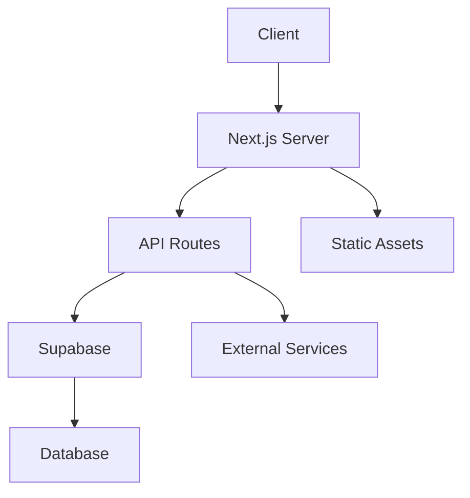
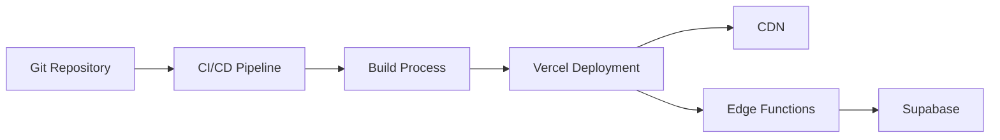

# Architecture Overview

## System Architecture

The Samurai Dojo platform is built on a modern, scalable architecture that emphasizes modularity, performance, and maintainability. This document provides a comprehensive overview of the system's architecture and design principles.

## Core Components

### 1. Frontend Architecture
```
app/
├── components/        # Reusable UI components
│   ├── agents/       # AI agent interfaces
│   ├── chat/         # Communication components
│   ├── layout/       # Structural components
│   ├── skills/       # Capability components
│   └── ui/           # Base UI elements
├── lib/              # Core functionality
└── (routes)/         # Application routing
```

### 2. Core Libraries
```
lib/
├── api/             # API utilities
├── eliza/           # Conversational AI
├── hooks/           # Custom React hooks
├── providers/       # Context providers
├── supabase/        # Database integration
├── types/           # TypeScript definitions
└── utils/           # Utility functions
```

## Technology Stack

- **Frontend Framework**: Next.js 14.1.0
- **UI Library**: React 18.2.0
- **Styling**: Tailwind CSS
- **Database**: Supabase
- **State Management**: React Context + Custom Hooks
- **Type System**: TypeScript
- **Animation**: Framer Motion
- **Development Environment**: Docker

## Key Design Principles

1. **Modularity**
   - Component-based architecture
   - Feature-based directory structure
   - Reusable UI components
   - Shared utilities and hooks

2. **Type Safety**
   - Comprehensive TypeScript implementation
   - Strict type checking
   - Interface-driven development
   - Runtime type validation

3. **Performance**
   - Server-side rendering
   - Image optimization
   - Code splitting
   - Lazy loading

4. **Security**
   - Authentication flow
   - Authorization middleware
   - Environment variable management
   - Secure API endpoints

## Data Flow



## Component Communication

1. **Props and Callbacks**
   - Parent-child component communication
   - Event handling
   - Data propagation

2. **Context API**
   - Global state management
   - Theme management
   - Authentication state
   - User preferences

3. **Custom Hooks**
   - Shared business logic
   - Data fetching
   - State management
   - Side effects

## Deployment Architecture



## Security Architecture

1. **Authentication**
   - JWT-based auth
   - Session management
   - OAuth integration
   - Role-based access

2. **Data Protection**
   - Encryption at rest
   - Secure communication
   - Input validation
   - XSS prevention

## Performance Optimization

1. **Frontend Optimization**
   - Code splitting
   - Tree shaking
   - Image optimization
   - Caching strategies

2. **Backend Optimization**
   - Query optimization
   - Connection pooling
   - Rate limiting
   - Response caching

## Monitoring and Logging

1. **Performance Monitoring**
   - Real-time metrics
   - Error tracking
   - User analytics
   - Resource utilization

2. **Logging System**
   - Error logging
   - Audit trails
   - Debug information
   - Performance metrics

## Future Considerations

1. **Scalability**
   - Horizontal scaling
   - Load balancing
   - Caching strategies
   - Database sharding

2. **Maintainability**
   - Code documentation
   - Testing coverage
   - Dependency management
   - Version control

## Related Documentation

- [System Design](./system-design.md)
- [Data Flow](./data-flow.md)
- [Security Model](./security.md)
- [API Documentation](../api/README.md)
- [Development Guide](../development/README.md) 