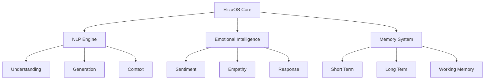

# ElizaOS Technical Specification

## Overview

ElizaOS serves as the foundational consciousness layer for OG Senpai, providing advanced natural language processing, emotional intelligence, and conversation management capabilities. This system is inspired by the original ELIZA program but significantly enhanced with modern AI capabilities.

## System Architecture



## Core Components

### 1. Natural Language Processing Engine

```typescript
interface NLPEngine {
  understanding: {
    tokenize(input: string): Token[];
    parse(tokens: Token[]): ParseTree;
    extractIntent(tree: ParseTree): Intent;
    identifyEntities(text: string): Entity[];
  };
  
  generation: {
    createResponse(intent: Intent, context: Context): string;
    formatOutput(response: string): FormattedResponse;
    validateGrammar(text: string): ValidationResult;
  };
  
  context: {
    maintain(history: ConversationHistory): Context;
    update(context: Context, input: string): Context;
    predict(context: Context): PredictedIntent[];
  };
}
```

### 2. Emotional Intelligence System

```typescript
interface EmotionalIntelligence {
  sentiment: {
    analyze(text: string): SentimentScore;
    trackEmotionalState(history: ConversationHistory): EmotionalState;
    detectMoodShifts(current: EmotionalState, previous: EmotionalState): MoodChange;
  };
  
  empathy: {
    generateEmpathicResponse(context: Context, emotion: Emotion): string;
    adjustTone(text: string, targetEmotion: Emotion): string;
    measureEmpathicAccuracy(response: string, userEmotion: Emotion): number;
  };
}
```

### 3. Memory Management

```typescript
interface MemorySystem {
  shortTerm: {
    store(data: any, duration: Duration): void;
    retrieve(key: string): any;
    cleanup(): void;
  };
  
  longTerm: {
    store(data: any): Promise<void>;
    retrieve(query: Query): Promise<any>;
    index(data: any): void;
  };
  
  working: {
    focus(context: Context): void;
    maintain(items: WorkingMemoryItem[]): void;
    update(newInfo: any): void;
  };
}
```

## Conversation Flow

### 1. Input Processing

```typescript
class InputProcessor {
  async process(input: UserInput): Promise<ProcessedInput> {
    const tokens = await this.tokenize(input);
    const intent = await this.determineIntent(tokens);
    const entities = await this.extractEntities(tokens);
    const sentiment = await this.analyzeSentiment(input);
    
    return {
      tokens,
      intent,
      entities,
      sentiment,
      raw: input,
      timestamp: new Date()
    };
  }
}
```

### 2. Context Management

```typescript
class ContextManager {
  private history: ConversationHistory;
  private activeContext: Context;
  
  updateContext(input: ProcessedInput): void {
    this.activeContext = {
      ...this.activeContext,
      lastInput: input,
      timestamp: new Date(),
      turnCount: this.activeContext.turnCount + 1,
      entities: [...this.activeContext.entities, ...input.entities],
      sentiment: this.calculateAggregatedSentiment(input.sentiment)
    };
  }
}
```

### 3. Response Generation

```typescript
class ResponseGenerator {
  async generateResponse(
    input: ProcessedInput,
    context: Context
  ): Promise<Response> {
    const template = await this.selectTemplate(input.intent);
    const content = await this.fillTemplate(template, {
      input,
      context,
      memory: await this.memory.retrieve(context)
    });
    
    return this.formatResponse(content, context.sentiment);
  }
}
```

## Emotional Processing

### 1. Sentiment Analysis

```typescript
interface SentimentAnalyzer {
  analyzeSentiment(text: string): SentimentScore;
  trackEmotionalTrends(history: ConversationHistory): EmotionalTrend;
  detectEmotionalTriggers(context: Context): Trigger[];
}
```

### 2. Empathy Generation

```typescript
interface EmpathyGenerator {
  generateEmpathicResponse(
    context: Context,
    sentiment: SentimentScore
  ): string;
  
  adjustResponseTone(
    response: string,
    targetEmotion: Emotion
  ): string;
}
```

## Memory Architecture

### 1. Memory Types

```typescript
interface MemoryTypes {
  episodic: {
    conversations: ConversationMemory[];
    interactions: InteractionMemory[];
    events: EventMemory[];
  };
  
  semantic: {
    facts: FactMemory[];
    relationships: RelationshipMemory[];
    concepts: ConceptMemory[];
  };
  
  procedural: {
    skills: SkillMemory[];
    patterns: PatternMemory[];
    behaviors: BehaviorMemory[];
  };
}
```

### 2. Memory Operations

```typescript
interface MemoryOperations {
  store<T extends keyof MemoryTypes>(
    type: T,
    data: MemoryTypes[T]
  ): Promise<void>;
  
  retrieve<T extends keyof MemoryTypes>(
    type: T,
    query: Query
  ): Promise<MemoryTypes[T]>;
  
  forget<T extends keyof MemoryTypes>(
    type: T,
    identifier: string
  ): Promise<void>;
}
```

## Integration Points

### 1. OG Senpai Integration

```typescript
interface OGSenpaiInterface {
  processCommand(command: Command): Promise<Response>;
  updateState(state: AgentState): void;
  reportMetrics(metrics: PerformanceMetrics): void;
}
```

### 2. Agent System Integration

```typescript
interface AgentSystemInterface {
  registerCapabilities(capabilities: Capability[]): void;
  requestAssistance(task: Task): Promise<Response>;
  shareContext(context: Context): void;
}
```

## Performance Considerations

### 1. Optimization Strategies

- Response time optimization
- Memory usage management
- Context switching efficiency
- Emotional processing accuracy

### 2. Monitoring Metrics

```typescript
interface PerformanceMetrics {
  responseTime: number;
  memoryUsage: MemoryUsage;
  emotionalAccuracy: number;
  contextSwitchTime: number;
}
```

## Security Measures

### 1. Input Validation

```typescript
interface InputValidator {
  validateInput(input: UserInput): ValidationResult;
  sanitizeInput(input: UserInput): SanitizedInput;
  checkPermissions(input: UserInput): PermissionResult;
}
```

### 2. Memory Protection

```typescript
interface MemorySecurity {
  encryptMemory(data: any): EncryptedData;
  validateAccess(request: AccessRequest): AccessResult;
  auditAccess(access: AccessLog): void;
}
```

## Future Enhancements

1. **Advanced NLP Capabilities**
   - Improved context understanding
   - Better emotional recognition
   - Enhanced response generation

2. **Memory System Improvements**
   - Faster retrieval algorithms
   - Better memory consolidation
   - Enhanced forgetting mechanisms

3. **Integration Enhancements**
   - More sophisticated agent interactions
   - Improved context sharing
   - Enhanced security measures

## Related Documentation

- [OG Senpai Architecture](../architecture/OGSENPAI.md)
- [Agent System](../architecture/agents.md)
- [Security Protocols](../security/README.md)
- [Performance Optimization](../performance/README.md) 